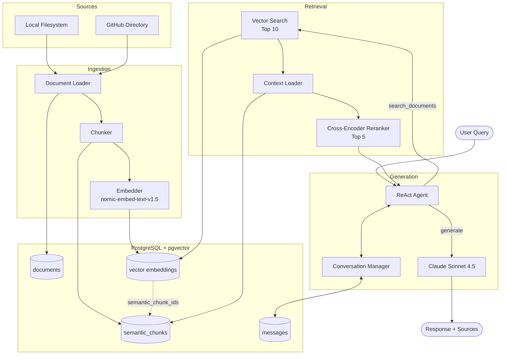
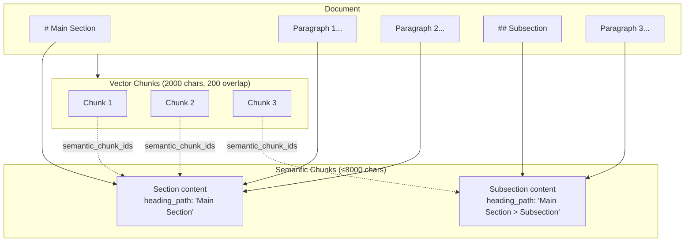
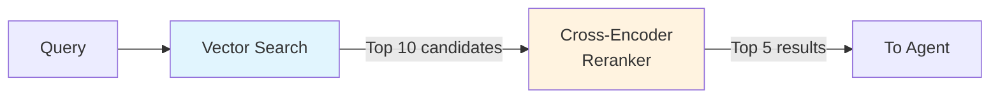

# Code Approach

**nasi-ayam** is a RAG-based knowledge retrieval chatbot that indexes documents from local filesystems and GitHub, then answers questions using Claude with cited sources.

## Core Capabilities

| Requirement | Implementation |
|-------------|----------------|
| RAG Pipeline | Two-stage retrieval: vector search → cross-encoder reranking → LLM generation |
| Agentic Reasoning | ReAct agent loop with tool-calling via LangGraph |
| Multi-step Queries | Agent decides to refine search or respond (max 3 iterations) |

## Agentic Capability

The agent uses LangGraph's ReAct pattern with two custom tools:

1. **`search_documents`** - Primary search with optional source/doc_type filters
2. **`refine_search`** - Search again with different keywords when results are insufficient

The LLM decides whether retrieved context answers the query or requires refinement. This is more flexible than threshold-based logic but less predictable.

# Architecture

# Design Decision #1: Two-Tier Chunking

## The Problem

RAG systems face a fundamental tension: small chunks retrieve precisely but lose context, while large chunks preserve context but reduce retrieval accuracy.

## The Solution: Semantic + Vector Chunks

| Layer | Size | Purpose |
|-------|------|---------|
| **Vector chunks** | 2000 chars, 200 overlap | Precise retrieval via embeddings |
| **Semantic chunks** | ≤8000 chars | Broader context (full sections) |

When a vector chunk is retrieved, its parent semantic chunk(s) provide the LLM with surrounding context. The 200-char overlap between vector chunks prevents information loss at boundaries (10% storage overhead).

## Trade-offs

| Pros | Cons |
|------|------|
| Small vectors = precise retrieval | More complex ingestion pipeline |
| Large semantic chunks = rich context | Storage overhead (content stored twice) |
| Heading paths aid citation | Markdown/PDF structure required for best results |

## What's Missing

- No inter-chunk linking (previous/next references)
- Plain text files get paragraph-based chunking only
- Very large sections without subheadings are excluded entirely

# Design Decision #2: Two-Stage Retrieval with Reranking

## The Problem

Vector similarity search is fast but imprecise. Embedding models compress semantic meaning into fixed vectors, losing nuance. A query about "cat breeds" might retrieve documents about "dog breeds" due to similar vector representations.

## The Solution: Retrieve Then Rerank

| Stage | Model | Speed | Accuracy |
|-------|-------|-------|----------|
| **Vector Search** | nomic-embed-text-v1.5 | Fast (embeddings pre-computed) | Moderate |
| **Reranking** | ms-marco-MiniLM-L-6-v2 | Slower (scores each pair) | High |

The cross-encoder sees both query and document together, enabling deeper semantic comparison than cosine similarity alone.

## Trade-offs

| Pros | Cons |
|------|------|
| Better relevance ranking | Added latency (~0.5s for 10 docs) |
| Small model (~90MB) | Sequential processing bottleneck |
| Filters out false positives | Fixed candidate pool (miss if not in top 10) |

## What's Missing

- No dynamic candidate pool sizing based on score distribution
- No query expansion or hypothetical document embeddings (HyDE)
- Could use semantic chunk linking to expand context of borderline results

# Reflection

## What Went Well

- **Docker isolation** eliminates "works on my machine" issues and prevents the user having to set up PostgreSQL + pgvector
- **Two-tier chunking** provides both retrieval precision and context richness
- **Reranking** noticeably improves result quality over vector search alone
- **Conversation persistence** with compaction handles long sessions gracefully

## What Was Hard

- **Alembic messed with my logging** since the app uses stdout to communicate with the user I configured the app to log to a file, Alembic was overwriting my logging configuration causing dropped logged messages, this tiny thing took more time than anything else to debug
- **Spinner/progress feedback** fought with stdout pollution from HuggingFace libraries
- **Model loading latency** on first query is jarring (~10s each for embeddings + reranker)
- **Agent unpredictability** - the LLM occasionally decides not to search despite explicit instructions

## Key Assumptions

- Documents are well-structured (headings in markdown/PDF, paragraphs in text)
- 10 initial candidates is sufficient to contain relevant results
- Single-user, single-conversation model is acceptable
- Local hardware can run embedding + reranking models (tested on RTX 2000 Ada)

## Improvements With More Time

| Area | Improvement |
|------|-------------|
| **Retrieval** | Add previous/next links to semantic chunks for context expansion |
| **Retrieval** | Implement HyDE (hypothetical document embeddings) for better query matching |
| **UX** | Eager model loading during startup to eliminate first-query latency |
| **Agent** | Add confidence scoring to make search/respond decisions more predictable |
| **Testing** | Integration tests for the full RAG pipeline, not just unit tests |
| **Observability** | Token usage tracking and cost estimation per query |
